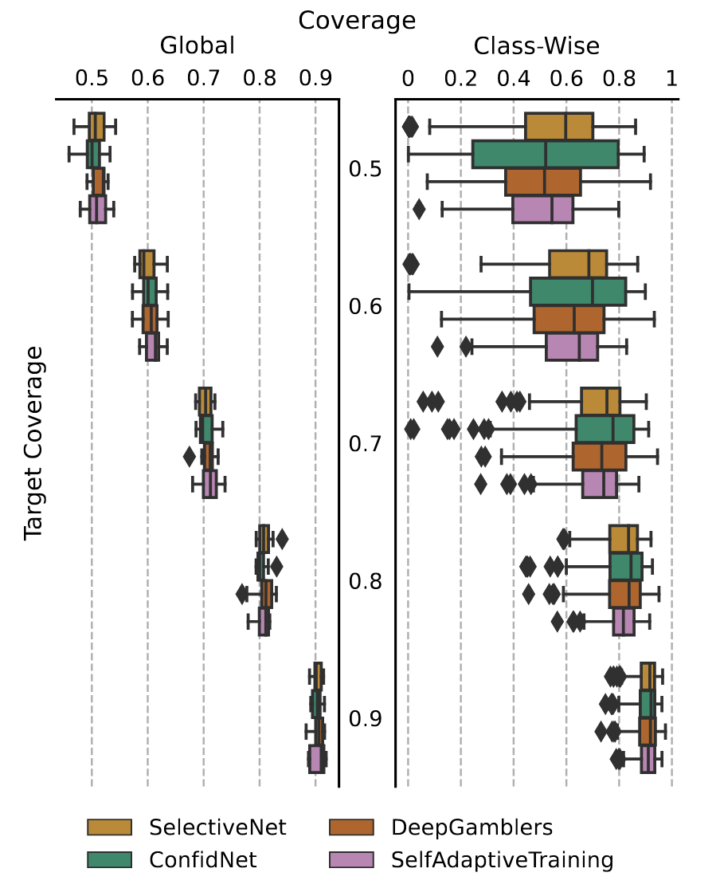

<h1 align="center">
Trusting the Untrustworthy: A Cautionary Tale on the\\Pitfalls of Training-based Rejection Option
</h1>



Fig 1. 

Submitted to ICML 2023.

## Requirements

To reproduce the results, you will need to install the packages listed in `requirements.txt` and have `python>=3.7` installed.

Please run `pip install -r requirements.txt` to install them.

## Usage


## Our Method


## Results


### (Optional) Environmental Variables

Please, place the following lines in your `.env` file if you want tyo modify any of the default folders.

```bash
#.env
export DATA_DIR=""
export IMAGENET_ROOT=""
export CHECKPOINTS_DIR=""
```

Where:

- `DATA_DIR` is the directory where the datasets will be downloaded.
- `IMAGENET_ROOT` is the directory where the ImageNet dataset is located.
- `CHECKPOINTS_DIR` is the directory where the pre-trained models will be placed.
