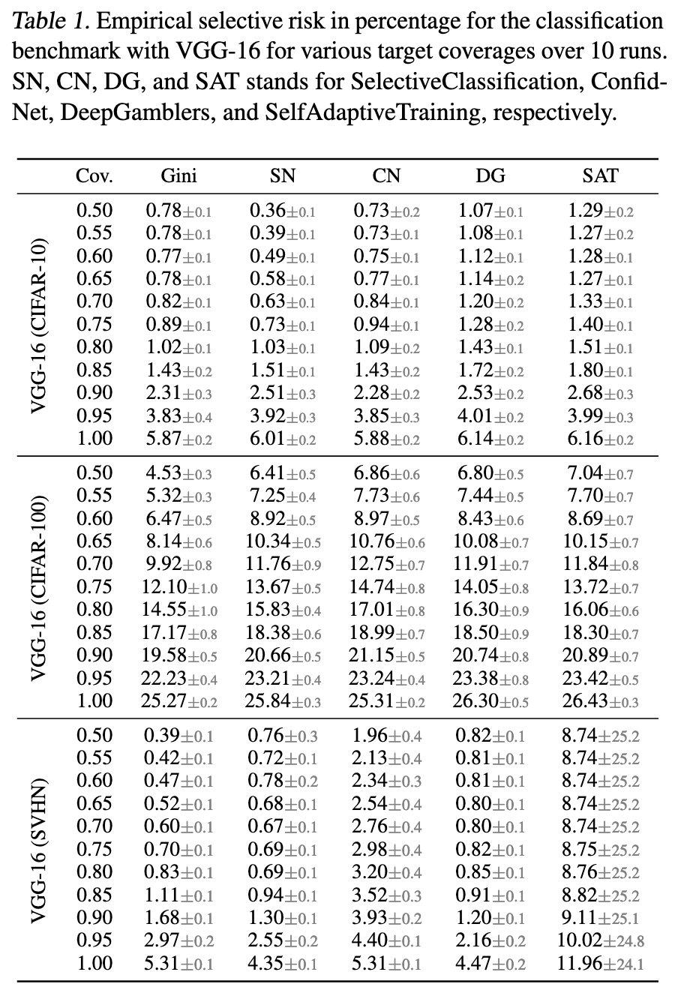

<h1 align="center">
Trusting the Untrustworthy: A Cautionary Tale on the Pitfalls of Training-based Rejection Option
</h1>

<p align="center">
  
</p>
Fig 1. Global coverage (left) refers to the proportion of the entire dataset that is covered by a model's predictions. Low variance in global coverage means that the method consistently covers the target portion of the dataset across different independent runs. However, this consistency in overall coverage may result in a large variance in the coverage for each individual class (right). In other words, the methods may perform well in covering some classes while not performing as well in covering others.

Submitted to ICML 2023.

## Requirements

To reproduce the results, you will need to install the packages listed in `requirements.txt` and have `python>=3.7` installed.

Please run `pip install -r requirements.txt` to install them.

## Usage


## Our Method


## Results

<p align="center">
  
</p>

### (Optional) Environmental Variables

Please, place the following lines in your `.env` file if you want tyo modify any of the default folders.

```bash
#.env
export DATA_DIR=""
export IMAGENET_ROOT=""
export CHECKPOINTS_DIR=""
```

Where:

- `DATA_DIR` is the directory where the datasets will be downloaded.
- `IMAGENET_ROOT` is the directory where the ImageNet dataset is located.
- `CHECKPOINTS_DIR` is the directory where the pre-trained models will be placed.
